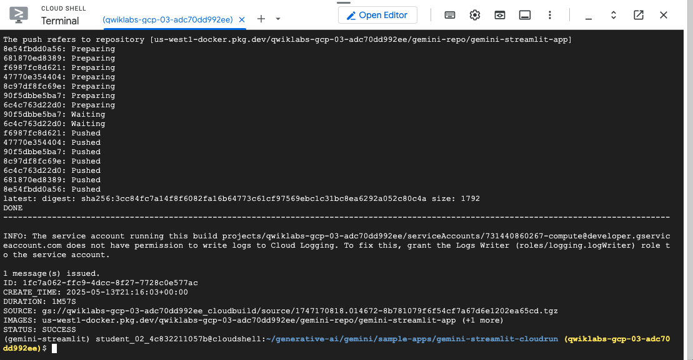

# GCP-LAB-Utilize-the-Streamlit-Framework-with-Cloud-Run-and-the-Gemini-API-in-Vertex-AI
Utilize the Streamlit Framework with Cloud Run and the Gemini API in Vertex AI

##### Overview

In this lab, you will learn how to build a generative AI application using the Gemini API in Vertex AI and deploying it on Cloud Run. You'll use the Streamlit framework to create an interactive interface for generating stories.

The lab involves running the application locally in Cloud Shell to test its functionality and then deploying it to Cloud Run for scalable serving. You'll gain practical experience integrating Gemini with a user interface and leveraging Cloud Run for efficient deployment.

###### Gemini
Gemini is a family of powerful generative AI models developed by Google DeepMind, capable of understanding and generating various forms of content, including text, code, images, audio, and video.

Gemini API in Vertex AI
The Gemini API in Vertex AI provides a unified interface for interacting with Gemini models. This allows developers to easily integrate these powerful AI capabilities into their applications. For the most up-to-date details and specific features of the latest versions, please refer to the official Gemini documentation.

Gemini Models
Gemini Pro: Designed for complex reasoning, including:
Analyzing and summarizing large amounts of information.
Sophisticated cross-modal reasoning (across text, code, images, etc.).
Effective problem-solving with complex codebases.
Gemini Flash: Optimized for speed and efficiency, offering:
Sub-second response times and high throughput.
High quality at a lower cost for a wide range of tasks.
Enhanced multimodal capabilities, including improved spatial understanding, new output modalities (text, audio, images), and native tool use (Google Search, code execution, and third-party functions).


###### Prerequisites
Before starting this lab, you should be familiar with:

Basic Python programming.
General API concepts.
Running Python code in a Jupyter notebook on Vertex AI Workbench.


###### Objectives
In this lab, you will learn how to:

Integrate Gemini API in Vertex AI with applications
Build and deploy the developed sample application on Google Cloud Run
Use the Streamlit framework to build a Cloud Run application


### Task 1. Build and Deploy the Application to Cloud Run

In this section, you will deploy the Streamlit Application in Cloud Run.

Clone the Repository
Open a new Cloud Shell terminal by clicking on the Cloud Shell icon in the top right corner of the Cloud console.

Run the following commands to clone the repo and navigate to gemini-streamlit-cloudrun directory in Cloud Shell using the following commands.

`git clone https://github.com/GoogleCloudPlatform/generative-ai.git --depth=1`

`cd generative-ai/gemini/sample-apps/gemini-streamlit-cloudrun`

To run the Streamlit Application on Cloud Run, you will need to perform some additional steps.


##### Configuration
Setup the Python virtual environment and install the dependencies:

```
python3 -m venv gemini-streamlit
source gemini-streamlit/bin/activate
pip install -r requirements.txt
```


Your application requires access to two environment variables:

```
GOOGLE_CLOUD_PROJECT : This the Google Cloud project ID.
GOOGLE_CLOUD_REGION : This is the region in which you are deploying your Cloud Run app. For e.g. us-central1.
```
These variables are needed since the Vertex AI initialization needs the Google Cloud project ID and the region. The specific code line from the app.py function is shown here: vertexai.init(project=PROJECT_ID, location=LOCATION)

In Cloud Shell, execute the following commands:

```
GOOGLE_CLOUD_PROJECT='qwiklabs-gcp-03-adc70dd992ee'
GOOGLE_CLOUD_REGION='us-west1'
```

You will now build the Docker image for the application and push it to Artifact Registry. To do this, you will need one environment variable set that will point to the Artifact Registry name. The commands below will create this Artifact Registry repository for you.

>Note: This step will take several minutes to complete.

In Cloud Shell, execute the following command:

```
AR_REPO='gemini-repo'
SERVICE_NAME='gemini-streamlit-app' 
gcloud artifacts repositories create "$AR_REPO" --location="$GOOGLE_CLOUD_REGION" --repository-format=Docker
gcloud builds submit --tag "$GOOGLE_CLOUD_REGION-docker.pkg.dev/$GOOGLE_CLOUD_PROJECT/$AR_REPO/$SERVICE_NAME"

```



Output:


DONE
--------------------------------------------------------------------------------
ID                                    CREATE_TIME                DURATION  SOURCE                                                                                                     IMAGES                                                                                              STATUS
a601ffd1-c282-43d2-942c-53cc13f43bf2  2023-12-18T11:37:30+00:00  2M29S     gs://qwiklabs-gcp-00-eb090e9513e8_cloudbuild/source/1702899440.87287-549e1a0cc5644b3c9535ff57f4a63d02.tgz  us-central1-docker.pkg.dev/qwiklabs-gcp-00-eb090e9513e8/gemini-repo/gemini-streamlit-app (+1 more)  SUCCESS


The final step is to deploy the service in Cloud Run with the image that we had built and had pushed to the Artifact Registry in the previous step.

```
gcloud run deploy "$SERVICE_NAME" \
  --port=8080 \
  --image="$GOOGLE_CLOUD_REGION-docker.pkg.dev/$GOOGLE_CLOUD_PROJECT/$AR_REPO/$SERVICE_NAME" \
  --allow-unauthenticated \
  --region=$GOOGLE_CLOUD_REGION \
  --platform=managed  \
  --project=$GOOGLE_CLOUD_PROJECT \
  --set-env-vars=GOOGLE_CLOUD_PROJECT=$GOOGLE_CLOUD_PROJECT,GOOGLE_CLOUD_REGION=$GOOGLE_CLOUD_REGION
```


On successful deployment, you will be provided a URL to the Cloud Run service. You can visit that in the browser to view the Cloud Run application that you just deployed.

Output:

⠼ Deploying new service... Done.

✓ Deploying new service... Done.

Done.  
Service [gemini-streamlit-app] revision [gemini-streamlit-app-00001-srg] has been deployed and is serving 100 percent of traffic. Service URL: https://gemini-streamlit-app-hc2gb6hsia-uc.a.run.app 
Choose the functionality that you would like to check out and the application will prompt the Gemini API in Vertex AI and display the responses.

Vertex Gemini

Click Check my progress to verify the objective.

